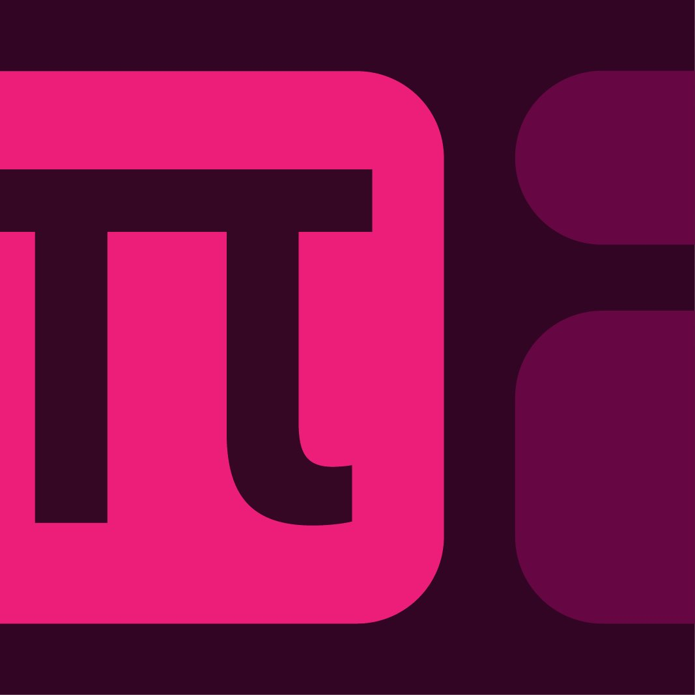

> [!WARNING]
> **Embeddium has merged RSO**, which means that you don't need to install TEO to use the similar video options screen.
> This mod has been archived. (See: https://github.com/ThinkingStudios/textrues-embeddium-options/issues/9)

# TexTrue's Embeddium Options

Port of Reese's Sodium Options to work with Embeddium on MinecraftForge/NeoForge.

## Building from source

#### Prerequisites

- Java 17 or above

#### Compiling

Navigate to the directory you've cloned this repository and launch a build with Gradle using `gradlew build` (Windows)
or `./gradlew build` (macOS/Linux). If you are not using the Gradle wrapper, simply replace `gradlew` with `gradle`
or the path to it.

The initial setup may take a few minutes. After Gradle has finished building everything, you can find the resulting
artifacts in `build/libs`.

## License

Reese's Sodium Options is license under MIT, a free and open-source license. For more information, please see the
[license file](LICENSE).
